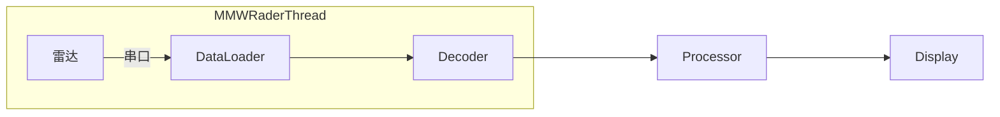
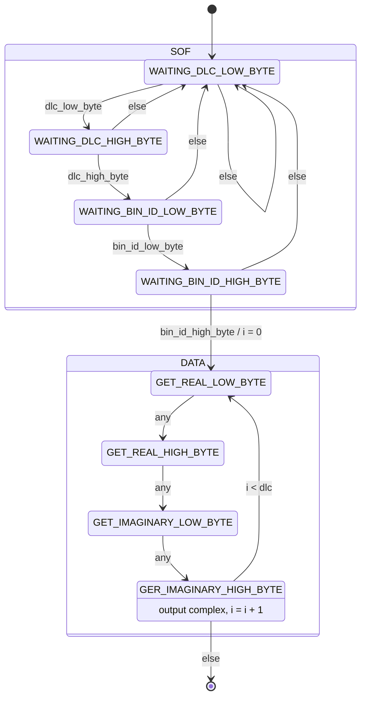

# 毫米波呼吸心率监测设备

一个基于毫米波雷达的心率、呼吸等生理指标的监测算法

## Pipeline结构

## 通信协议

### 帧格式

数据为**小端序**

|SOF|Data|
|-|-|
|4Bytes|40Bytes|

**SOF**: 数据长度2Bytes，bin序号2Bytes
**Data**: 实数2Bytes, 虚数2Bytes, 共10个复数

#### 解码状态机

### 测试数据

输入:
0A 00 00 00 A6 FC 6E FC 3E 02 3A FE F9 01 C2 01 76 FD 47 01 4A 01 09 FD 64 01 36 04 0F FB 7E FE 2A 03 E6 FC 11 01 72 02 29 FF AE 00 0A 00 01 00 B1 FE A4 06 A9 FC 55 FF 4B 00 CA FE 28 00 6B FE B6 03 B4 00 69 FE A2 03 20 FE 85 FE 41 01 81 FF DC FF F3 01 4F FD 6C FF 0A 00 02 00 FB 00 32 04 B6 FD FD 00 97 FF AD FE E0 00 C7 FF E5 FF 0C 01 B5 FE 80 FF 6A 00 80 FE 92 01 17 00 3E 00 25 01 5F FF A8 00 0A 00 03 00 5D FC EE 03 4F FF 47 FB B1 03 38 01 1C FE E9 01 1F FF 06 FF DB FF E6 FE E4 00 E5 FF F0 FF 46 FF 28 02 C6 00 61 FE F3 01 0A 00 04 00 D1 FF 9C FC 6A 03 02 02 1F FF B2 01 A5 FE 75 00 49 FF A8 FD F1 03 C4 FF 3E FF C9 04 51 FC 80 FE 3E 01 7E FE 40 00 82 00 0A 00 05 00 7B 02 83 03 2B FD 54 03 00 FE B3 FE 13 00 34 FF 3D 00 75 FF 3F 01 22 00 87 FF FA 01 16 FE 0A FF 0B 01 F8 FE 57 00 AF 00 0A 00 06 00 3A 01 2C 00 82 00 14 01 E0 FD C3 FF EF 00 59 FD B1 02 91 01 9C FD 1E 02 04 FF 1B FD 7B 02 5A 00 9D FE 24 01 1E 00 5F FE 0A 00 07 00 5F 04 08 FC F9 FF C4 03 7B FF 35 FC E9 04 4B 03 85 FA ED 02 EE FF F9 FA 42 03 14 01 55 FF F4 01 DA FE A7 FF B3 00 B2 FF 

输出：

## 文件

### mmw_rader.py

毫米波相关代码