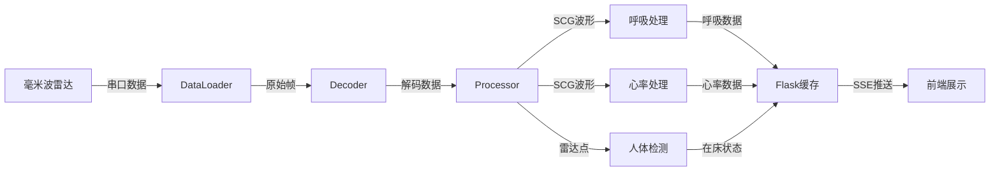
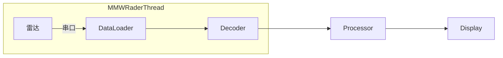
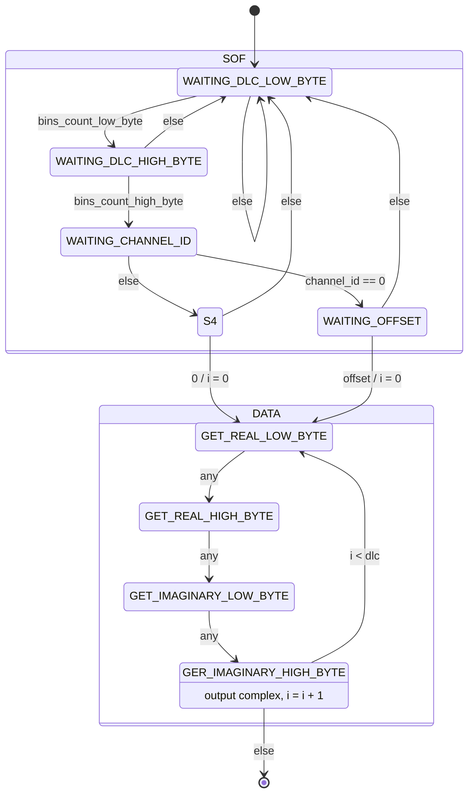
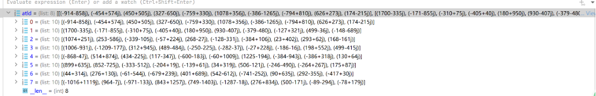

# 毫米波健康监测系统 🌟

一个基于毫米波雷达的**实时健康监测系统**，支持呼吸率、心率等生理指标的监测、存储与可视化。


# 快速使用
```bash
./start_server.sh
./start_backend.sh
./start_frontend.sh
```

## ✨ 特性

- 🎯 **实时监测**：呼吸率、心率、心率变异性（HRV）、心律失常检测
- 📊 **数据可视化**：基于 ECharts 的动态波形图表
- 💾 **数据存储**：SQLite数据库，支持波形数据和历史查询
- 🔄 **流水线架构**：多线程并行处理，雷达→处理→数据库完整流程
- 🌐 **Web界面**：Vue3前端，响应式设计
- 🛡️ **类型安全**：Vue3 + TypeScript 前端架构
- 📈 **采样率**：200Hz高精度采样，每秒200个数据点

## 🚀 快速开始

### 方式1: 一键启动流水线（推荐）

**Windows:**
```bash
# 双击运行或命令行执行
start_pipeline.bat
```

**Linux/macOS:**
```bash
chmod +x start_pipeline.sh
./start_pipeline.sh
```

**或使用Python命令:**
```bash
python src/run_pipeline.py --uid 0 --port COM7 --baudrate 921600
```

### 方式2: 分步启动（开发调试）

**1. 安装Python依赖**
```bash
pip install -r requirements.txt
```

**2. 启动数据采集流水线**
```bash
python src/run_pipeline.py
```

**3. 启动Flask后端API**
```bash
cd backend
python app.py
```

**4. 启动Vue前端**
```bash
cd frontend
npm install
npm run dev
# 后端运行在 http://localhost:5000

# 3. 启动Vue前端（新终端）
cd frontend
npm install
npm run dev
# 前端运行在 http://localhost:5173

# 4. 运行服务端数据采集（新终端，需要雷达硬件）
cd src
python main_with_backend.py
```

### 方式2: 测试数据推送（无需硬件）

```bash
# 1. 启动后端
cd backend
python app.py

# 2. 测试数据推送
cd src
python test_backend_push.py

# 3. 启动前端查看数据
cd frontend
npm run dev
```

详细文档：[QUICKSTART.md](QUICKSTART.md) | [src/README_BACKEND_INTEGRATION.md](src/README_BACKEND_INTEGRATION.md)

## 📁 项目结构

```text
📦 Millimeter-wave-Respiratory-and-Heart-Rate-Monitoring-Device/
├── 📂 backend/                  # Flask后端 + 数据库 ⭐ 新增
│   ├── app.py                  # Flask应用主文件
│   ├── config.py               # 配置文件
│   ├── models.py               # 数据库模型（SQLAlchemy）
│   ├── database.py             # 数据库管理类
│   ├── routes/                 # API路由
│   │   ├── breath.py           # 呼吸相关API
│   │   ├── heart.py            # 心率相关API
│   │   └── history.py          # 历史数据API
│   ├── data/                   # SQLite数据库目录
│   │   └── mmw_monitor.db      # 数据库文件（自动生成）
│   ├── example_client.py       # API调用示例
│   ├── test_api.py             # API测试工具
│   ├── manage_db.py            # 数据库管理工具
│   └── README.md               # 后端文档
├── 📂 src/                      # 服务端数据处理模块
│   ├── mmw_rader.py            # 雷达数据采集
│   ├── mmw_processor.py        # SCG波形处理
│   ├── mmw_breath.py           # 呼吸信号处理
│   ├── mmw_heart_rate.py       # 心率信号处理
│   ├── mmw_human_check.py      # 人体存在检测
│   ├── mmw_backend_pusher.py   # 后端数据推送 ⭐ 新增
│   ├── main_with_backend.py    # 主程序（带推送）⭐ 新增
│   ├── test_backend_push.py    # 推送测试工具 ⭐ 新增
│   └── README_BACKEND_INTEGRATION.md  # 集成文档 ⭐
├── 📂 frontend/                 # Vue3前端（Web界面）
│   ├── src/                    # 源码
│   │   ├── api/                # API接口定义
│   │   ├── components/         # Vue组件
│   │   ├── router/             # 路由配置
│   │   ├── store/              # 状态管理
│   │   └── views/              # 页面视图
│   ├── public/                 # 静态资源
│   └── package.json            # 项目配置
├── 📂 source/                   # 旧代码（保留参考）
├── 📂 visualize/               # 可视化脚本
├── 📂 test/                    # 测试脚本
├── 📂 firmware/                # 固件文件
├── requirements.txt            # Python依赖
├── QUICKSTART.md              # 快速开始
└── README.md                  # 本文件
```

## 🏗️ 系统架构

### 完整数据流程

```text
┌──────────────┐
│  毫米波雷达   │ 串口数据
│  (硬件传感器) │
└──────┬───────┘
       │
       ↓ 200Hz FFT数据
┌──────────────────────────────────┐
│  服务端数据处理 (src/)            │
│  ├─ mmw_rader.py (数据采集)      │
│  ├─ mmw_processor.py (SCG处理)   │
│  ├─ mmw_breath.py (呼吸处理)     │
│  ├─ mmw_heart_rate.py (心率处理) │
│  └─ mmw_human_check.py (人体检测)│
└──────┬───────────────────────────┘
       │ 处理结果
       ↓
┌──────────────────────────────────┐
│  异步数据推送 (mmw_backend_pusher)│
│  - 批量推送波形数据（200点/秒）   │
│  - 实时推送指标数据               │
└──────┬───────────────────────────┘
       │ HTTP POST/PUT
       ↓
┌──────────────────────────────────┐
│  Flask后端 (backend/)             │
│  ├─ RESTful API                  │
│  ├─ 数据验证                     │
│  └─ 业务逻辑                     │
└──────┬───────────────────────────┘
       │ ORM操作
       ↓
┌──────────────────────────────────┐
│  SQLite数据库                     │
│  ├─ 用户信息                     │
│  ├─ 波形数据（200Hz采样）         │
│  ├─ 指标数据（心率、呼吸率等）    │
│  └─ 历史统计                     │
└──────┬───────────────────────────┘
       │ HTTP GET
       ↓
┌──────────────────────────────────┐
│  Vue3前端 (frontend/)             │
│  ├─ 实时波形展示                 │
│  ├─ 历史数据查询                 │
│  └─ 统计图表                     │
└──────────────────────────────────┘
```

### 技术栈

**后端 (backend/)**
- Flask 3.0 - Web框架
- SQLAlchemy - ORM
- SQLite - 数据库
- Flask-CORS - 跨域支持

**服务端 (src/)**
- PySerial - 串口通信
- NumPy - 数值计算
- SciPy - 信号处理
- Requests - HTTP客户端

**前端 (frontend/)**
- Vue 3 - 渐进式框架
- TypeScript - 类型安全
- Vite - 构建工具
- ECharts - 图表库
- Element Plus - UI组件
└─────────────────────────────────────┘
```

### 后端（Flask + Python）

```
┌─────────────────────────────────────┐
│         Flask 3.0 API 服务          │
├─────────────────────────────────────┤
│  • CORS 跨域支持                    │
│  • SSE 实时推送                     │
│  • 多线程数据处理                   │
│  • JSON API (code: 20000)          │
└─────────────────────────────────────┘
```

### 数据处理流程



## Pipeline结构



## 通信协议

### 帧格式

数据为**小端序**

|SOF|Data|
|-|-|
|4Bytes|40Bytes|

**SOF**: 每个通道的频率bin数量2Bytes，通道序号1Bytes；当通道序号为0时第四字节为offset，否则为0
**Data**: 实数2Bytes, 虚数2Bytes, 共10个复数

#### 解码状态机



### 测试数据

输入:
0A 00 00 00 A6 FC 6E FC 3E 02 3A FE F9 01 C2 01 76 FD 47 01 4A 01 09 FD 64 01 36 04 0F FB 7E FE 2A 03 E6 FC 11 01 72 02 29 FF AE 00 0A 00 01 00 B1 FE A4 06 A9 FC 55 FF 4B 00 CA FE 28 00 6B FE B6 03 B4 00 69 FE A2 03 20 FE 85 FE 41 01 81 FF DC FF F3 01 4F FD 6C FF 0A 00 02 00 FB 00 32 04 B6 FD FD 00 97 FF AD FE E0 00 C7 FF E5 FF 0C 01 B5 FE 80 FF 6A 00 80 FE 92 01 17 00 3E 00 25 01 5F FF A8 00 0A 00 03 00 5D FC EE 03 4F FF 47 FB B1 03 38 01 1C FE E9 01 1F FF 06 FF DB FF E6 FE E4 00 E5 FF F0 FF 46 FF 28 02 C6 00 61 FE F3 01 0A 00 04 00 D1 FF 9C FC 6A 03 02 02 1F FF B2 01 A5 FE 75 00 49 FF A8 FD F1 03 C4 FF 3E FF C9 04 51 FC 80 FE 3E 01 7E FE 40 00 82 00 0A 00 05 00 7B 02 83 03 2B FD 54 03 00 FE B3 FE 13 00 34 FF 3D 00 75 FF 3F 01 22 00 87 FF FA 01 16 FE 0A FF 0B 01 F8 FE 57 00 AF 00 0A 00 06 00 3A 01 2C 00 82 00 14 01 E0 FD C3 FF EF 00 59 FD B1 02 91 01 9C FD 1E 02 04 FF 1B FD 7B 02 5A 00 9D FE 24 01 1E 00 5F FE 0A 00 07 00 5F 04 08 FC F9 FF C4 03 7B FF 35 FC E9 04 4B 03 85 FA ED 02 EE FF F9 FA 42 03 14 01 55 FF F4 01 DA FE A7 FF B3 00 B2 FF

输出：


## 文件

### mmw_rader.py

毫米波设备管理代码，用于串口读取、解码、存储雷达原始数据。

**主要功能：**

- 基于状态机的帧解码
- 支持8个通道 × 每通道10个频率bin的数据采集
- 线程安全的队列输出
- 自动处理小端序数据

### mmw_processor.py

毫米波雷达数据处理模块，从雷达线程获取FFT数据并生成SCG（心冲击图）波形。
只使用通道0的数据进行处理（其他通道在实际检测中数据差别不大）。

**核心算法：**

1. **滑动窗口缓冲**：维护1000帧历史数据用于批处理
2. **能量最大bin选择**：动态选择能量最强的频率bin进行分析
3. **相位展开**：使用`np.unwrap`消除2π周期性跳变
4. **7点加权二阶导数**（向量化计算）：

   ```text
   f''(x) ≈ [4f(x) + f(x+1) + f(x-1) - 2f(x+2) - 2f(x-2) - f(x+3) - f(x-3)] / (16h²)
   ```

   其中 h = 0.005s（采样间隔）

5. **异常值过滤**：阈值 ±1500
6. **批处理输出**：每1000帧生成1000个SCG数据点

**使用示例：**

```python
from queue import Queue
from mmw_rader import MMWRaderThread
from mmw_processor import MMWProcessorThread

# 创建数据队列
data_queue = Queue()

# 启动雷达线程（生产者）
radar = MMWRaderThread(
    output_queue=data_queue,
    serial_port="COM7",
    serial_baudrate=921600
)

# 启动处理线程（消费者）
processor = MMWProcessorThread(
    input_queue=data_queue,
    buffer_size=1000,  # 1000帧批处理
    callback=lambda scg, idx: print(f"Frame {idx}: {scg[0]:.2f}")
)

radar.start()
processor.start()
```

### mmw_breath.py

毫米波呼吸信号处理模块，从雷达线程获取FFT数据并生成呼吸波形和呼吸周期信息。
基于 `breath_old.py` 改编，集成到流水线架构中。

**核心算法：**

1. **能量最大bin选择**：在通道0中选择能量最强的频率bin
2. **相位提取与展开**：使用`np.unwrap`消除2π周期性跳变
3. **基线漂移去除**：5秒窗口移动平均
4. **信号平滑**：1.7秒滑动窗口平滑
5. **峰谷检测**：识别呼吸周期的起止点
6. **周期提取**：计算位移（displacement）和流速（flow rate）

**输出数据：**

```python
breath_dict = {
    'rr_wave': phase_info,        # 呼吸波形（1000点）
    'displacement': displacement,  # 位移（归一化）
    'flow_rate': flow_rate,        # 流速（归一化梯度）
    'target_bin': bin_index,       # 选中的频率bin
    'frame_idx': frame_number      # 帧编号
}
```

**使用示例：**

```python
from queue import Queue
from mmw_rader import MMWRaderThread
from mmw_breath import MMWBreathThread

# 创建数据队列
data_queue = Queue()

# 启动雷达线程
radar = MMWRaderThread(
    output_queue=data_queue,
    serial_port="COM7",
    serial_baudrate=921600
)

# 启动呼吸处理线程
breath = MMWBreathThread(
    input_queue=data_queue,
    buffer_size=1000,  # 5秒数据缓冲
    callback=lambda breath_dict: print(f"呼吸周期点数: {len(breath_dict['displacement'])}")
)

radar.start()
breath.start()
```

### mmw_heart_rate.py

毫米波心率信号处理模块，从雷达线程获取FFT数据并生成心率和心率变异性（HRV）信息。
基于 `heart_rate_old.py` 改编，集成到流水线架构中。

**核心算法：**

1. **能量最大bin选择**：在通道0中选择能量最强的频率bin
2. **相位提取与展开**：使用`np.unwrap`消除2π周期性跳变
3. **7点加权二阶导数**：生成SCG（心冲击图）波形
4. **异常值过滤**：阈值 ±1500
5. **带通滤波**：20-40 Hz，使用Butterworth滤波器
6. **峰值检测**：识别心跳峰值
7. **RR间期计算**：计算峰值间时间间隔
8. **心率计算**：基于RR间期计算心率（bpm）
9. **HRV指标**：计算SDNN、RMSSD、pNN50

**输出数据：**

```python
hr_dict = {
    'heart_rate': 72.5,               # 心率（bpm）
    'rr_intervals': [0.8, 0.85, ...], # RR间期数组（秒）
    'hrv_sdnn': 45.2,                 # SDNN标准差（ms）
    'hrv_rmssd': 38.6,                # RMSSD均方根（ms）
    'hrv_pnn50': 12.5,                # pNN50百分比（%）
    'peak_count': 12,                 # 检测到的峰值数
    'scg_waveform': [...],            # 最近100个SCG点
    'max_bin': 3,                     # 能量最大的bin
    'frame_idx': 1000,                # 帧编号
    'timestamp': 5.0                  # 时间戳（秒）
}
```

**使用示例：**

```python
from queue import Queue
from mmw_rader import MMWRaderThread
from mmw_heart_rate import MMWHeartRateThread

# 创建数据队列
data_queue = Queue()

# 启动雷达线程
radar = MMWRaderThread(
    output_queue=data_queue,
    serial_port="COM7",
    serial_baudrate=921600
)

# 启动心率处理线程
heart_rate = MMWHeartRateThread(
    input_queue=data_queue,
    buffer_size=1000,  # 5秒数据缓冲
    callback=lambda hr_dict: print(f"心率: {hr_dict['heart_rate']:.1f} bpm")
)

radar.start()
heart_rate.start()
```

### mmw_human_check.py

毫米波人体存在检测模块，从雷达线程获取FFT数据并判断是否有人存在。
基于 `human_check_old.py` 改编，集成到流水线架构中。

**核心算法：**

1. **波动检测（HumanCheckByWave）**：
   - 累积一定帧数，判断能量波动是否超过阈值
   - 支持微动检测（小幅度长时间）和大动检测（大幅度短时间）

2. **峰值检测（HumanCheckByPeak）**：
   - 判断FFT峰值是否超过预设阈值
   - 使用45个bin的阈值表进行分级判断

3. **综合判断（HumanCheck）**：
   - 结合3种检测方法（小波动、大波动、峰值）
   - 至少2种方法判断有人时才确认有人存在

**输出数据：**

```python
result = {
    'has_human': True,          # 是否检测到人体
    'frame_count': 1523,        # 已接收帧数
    'offset': 0,                # 检测窗口偏移
    'detection_rate': 0.85      # 最近100帧的检测率
}
```

**使用示例：**

```python
from queue import Queue
from mmw_rader import MMWRaderThread
from mmw_human_check import MMWHumanCheckThread

# 创建数据队列
data_queue = Queue()

# 启动雷达线程
radar = MMWRaderThread(
    output_queue=data_queue,
    serial_port="COM7",
    serial_baudrate=921600
)

# 启动人体检测线程
human_check = MMWHumanCheckThread(
    input_queue=data_queue,
    callback=lambda result: print(f"有人: {result['has_human']}")
)

radar.start()
human_check.start()
```

### visualize_scg.py

实时可视化SCG波形，支持滑动窗口显示（默认1000个数据点）。

**运行方式：**

```bash
conda activate breath
python visuallize/visualize_scg.py
```

### visualize_breath.py

实时可视化呼吸波形和呼吸周期图（位移-流速循环），支持双图显示。

**运行方式：**

```bash
conda activate breath
python visuallize/visualize_breath.py
```

### visualize_heart_rate.py

实时可视化心率监测数据，包括SCG波形、心率趋势、HRV指标（SDNN、RMSSD、pNN50）。

**功能特点：**

- SCG波形实时显示（1000点滑动窗口）
- 心率趋势曲线（最近50次记录）
- HRV指标动态图表
- 实时统计信息面板

**运行方式：**

```bash
conda activate breath
python visuallize/visualize_heart_rate.py
```

### visualize_human_check.py

实时可视化人体存在检测状态，包括检测状态指示器、检测率趋势、历史时间线。

**功能特点：**

- 圆形状态指示器（绿色=有人，红色=无人）
- 检测率趋势曲线（百分比）
- 检测历史时间线（最近200帧）
- Offset变化监测
- 统计信息面板

**运行方式：**

```bash
conda activate breath
python visuallize/visualize_human_check.py
```

## 测试脚本

所有测试脚本位于 `test/` 目录下：

```bash
# 测试雷达解码速率
python test/test_decode_rate.py

# 测试SCG处理器吞吐量
python test/test_processor_throughput.py

# 测试呼吸处理器吞吐量
python test/test_breath_throughput.py

# 测试串口数据接收速率
python test/test_serial_rate.py

# 测试心率和人体检测模块
python test/test_heart_rate_human_check.py
```

## 环境配置

**Python环境：** `breath` (conda)

**依赖包：**

```bash
pip install pyserial numpy matplotlib scipy
```

## 数据流

### SCG处理流水线

```text
雷达硬件 → 串口 → MMWRaderThread → Queue → MMWProcessorThread → SCG波形 → 可视化
          (解码)                    (FFT)      (相位二阶导数)
```

### 呼吸处理流水线

```text
雷达硬件 → 串口 → MMWRaderThread → Queue → MMWBreathThread → 呼吸波形/周期 → 可视化
          (解码)                    (FFT)   (相位处理+峰谷检测)
```

### 心率处理流水线

```text
雷达硬件 → 串口 → MMWRaderThread → Queue → MMWHeartRateThread → 心率/HRV → 输出
          (解码)                    (FFT)   (相位二阶导数+峰值检测)
```

### 人体检测流水线

```text
雷达硬件 → 串口 → MMWRaderThread → Queue → MMWHumanCheckThread → 人体存在判断 → 输出
          (解码)                    (FFT)     (能量波动+峰值检测)
```
