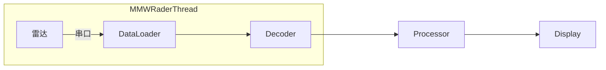
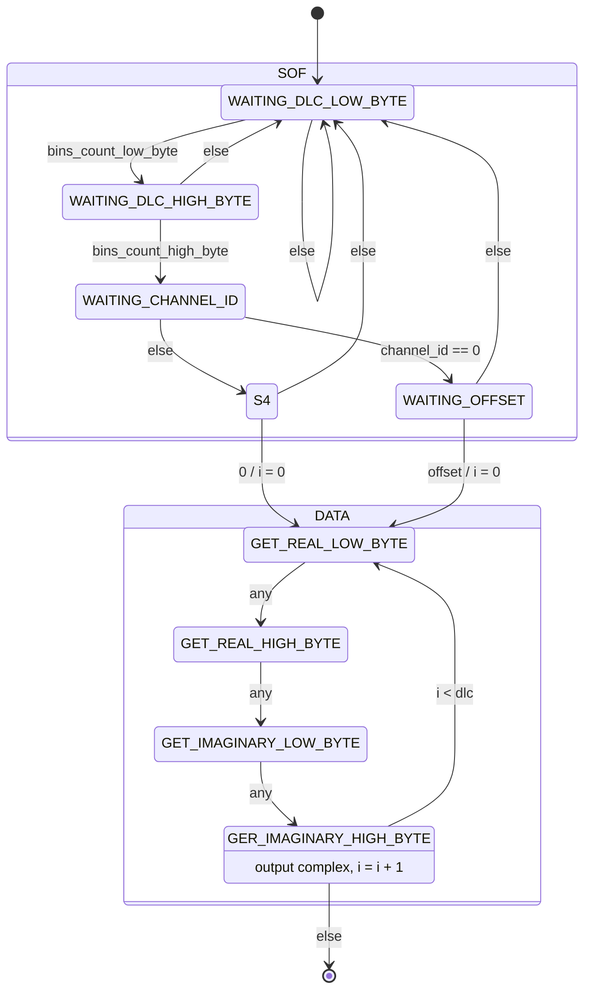

# 毫米波呼吸心率监测设备

一个基于毫米波雷达的心率、呼吸等生理指标的监测算法

## 项目结构

```text
├── src/                      # 核心模块
│   ├── mmw_rader.py         # 雷达数据采集
│   ├── mmw_processor.py     # SCG波形处理
│   └── mmw_breath.py        # 呼吸信号处理
├── visuallize/              # 可视化脚本
│   ├── visualize_scg.py     # SCG波形可视化
│   └── visualize_breath.py  # 呼吸信号可视化
├── test/                    # 测试脚本
│   ├── test_decode_rate.py
│   ├── test_processor_throughput.py
│   ├── test_breath_throughput.py
│   └── test_serial_rate.py
└── source/                  # 原始算法代码
    └── breath_old.py
```

## Pipeline结构



## 通信协议

### 帧格式

数据为**小端序**

|SOF|Data|
|-|-|
|4Bytes|40Bytes|

**SOF**: 每个通道的频率bin数量2Bytes，通道序号1Bytes；当通道序号为0时第四字节为offset，否则为0
**Data**: 实数2Bytes, 虚数2Bytes, 共10个复数

#### 解码状态机



### 测试数据

输入:
0A 00 00 00 A6 FC 6E FC 3E 02 3A FE F9 01 C2 01 76 FD 47 01 4A 01 09 FD 64 01 36 04 0F FB 7E FE 2A 03 E6 FC 11 01 72 02 29 FF AE 00 0A 00 01 00 B1 FE A4 06 A9 FC 55 FF 4B 00 CA FE 28 00 6B FE B6 03 B4 00 69 FE A2 03 20 FE 85 FE 41 01 81 FF DC FF F3 01 4F FD 6C FF 0A 00 02 00 FB 00 32 04 B6 FD FD 00 97 FF AD FE E0 00 C7 FF E5 FF 0C 01 B5 FE 80 FF 6A 00 80 FE 92 01 17 00 3E 00 25 01 5F FF A8 00 0A 00 03 00 5D FC EE 03 4F FF 47 FB B1 03 38 01 1C FE E9 01 1F FF 06 FF DB FF E6 FE E4 00 E5 FF F0 FF 46 FF 28 02 C6 00 61 FE F3 01 0A 00 04 00 D1 FF 9C FC 6A 03 02 02 1F FF B2 01 A5 FE 75 00 49 FF A8 FD F1 03 C4 FF 3E FF C9 04 51 FC 80 FE 3E 01 7E FE 40 00 82 00 0A 00 05 00 7B 02 83 03 2B FD 54 03 00 FE B3 FE 13 00 34 FF 3D 00 75 FF 3F 01 22 00 87 FF FA 01 16 FE 0A FF 0B 01 F8 FE 57 00 AF 00 0A 00 06 00 3A 01 2C 00 82 00 14 01 E0 FD C3 FF EF 00 59 FD B1 02 91 01 9C FD 1E 02 04 FF 1B FD 7B 02 5A 00 9D FE 24 01 1E 00 5F FE 0A 00 07 00 5F 04 08 FC F9 FF C4 03 7B FF 35 FC E9 04 4B 03 85 FA ED 02 EE FF F9 FA 42 03 14 01 55 FF F4 01 DA FE A7 FF B3 00 B2 FF

输出：


## 文件

### mmw_rader.py

毫米波设备管理代码，用于串口读取、解码、存储雷达原始数据。

**主要功能：**

- 基于状态机的帧解码
- 支持8个通道 × 每通道10个频率bin的数据采集
- 线程安全的队列输出
- 自动处理小端序数据

### mmw_processor.py

毫米波雷达数据处理模块，从雷达线程获取FFT数据并生成SCG（心冲击图）波形。
只使用通道0的数据进行处理（其他通道在实际检测中数据差别不大）。

**核心算法：**

1. **滑动窗口缓冲**：维护1000帧历史数据用于批处理
2. **能量最大bin选择**：动态选择能量最强的频率bin进行分析
3. **相位展开**：使用`np.unwrap`消除2π周期性跳变
4. **7点加权二阶导数**（向量化计算）：

   ```text
   f''(x) ≈ [4f(x) + f(x+1) + f(x-1) - 2f(x+2) - 2f(x-2) - f(x+3) - f(x-3)] / (16h²)
   ```

   其中 h = 0.005s（采样间隔）

5. **异常值过滤**：阈值 ±1500
6. **批处理输出**：每1000帧生成1000个SCG数据点

**使用示例：**

```python
from queue import Queue
from mmw_rader import MMWRaderThread
from mmw_processor import MMWProcessorThread

# 创建数据队列
data_queue = Queue()

# 启动雷达线程（生产者）
radar = MMWRaderThread(
    output_queue=data_queue,
    serial_port="COM7",
    serial_baudrate=921600
)

# 启动处理线程（消费者）
processor = MMWProcessorThread(
    input_queue=data_queue,
    buffer_size=1000,  # 1000帧批处理
    callback=lambda scg, idx: print(f"Frame {idx}: {scg[0]:.2f}")
)

radar.start()
processor.start()
```

### mmw_breath.py

毫米波呼吸信号处理模块，从雷达线程获取FFT数据并生成呼吸波形和呼吸周期信息。
基于 `breath_old.py` 改编，集成到流水线架构中。

**核心算法：**

1. **能量最大bin选择**：在通道0中选择能量最强的频率bin
2. **相位提取与展开**：使用`np.unwrap`消除2π周期性跳变
3. **基线漂移去除**：5秒窗口移动平均
4. **信号平滑**：1.7秒滑动窗口平滑
5. **峰谷检测**：识别呼吸周期的起止点
6. **周期提取**：计算位移（displacement）和流速（flow rate）

**输出数据：**

```python
breath_dict = {
    'rr_wave': phase_info,        # 呼吸波形（1000点）
    'displacement': displacement,  # 位移（归一化）
    'flow_rate': flow_rate,        # 流速（归一化梯度）
    'target_bin': bin_index,       # 选中的频率bin
    'frame_idx': frame_number      # 帧编号
}
```

**使用示例：**

```python
from queue import Queue
from mmw_rader import MMWRaderThread
from mmw_breath import MMWBreathThread

# 创建数据队列
data_queue = Queue()

# 启动雷达线程
radar = MMWRaderThread(
    output_queue=data_queue,
    serial_port="COM7",
    serial_baudrate=921600
)

# 启动呼吸处理线程
breath = MMWBreathThread(
    input_queue=data_queue,
    buffer_size=1000,  # 5秒数据缓冲
    callback=lambda breath_dict: print(f"呼吸周期点数: {len(breath_dict['displacement'])}")
)

radar.start()
breath.start()
```

### visualize_scg.py

实时可视化SCG波形，支持滑动窗口显示（默认1000个数据点）。

**运行方式：**

```bash
conda activate breath
python visuallize/visualize_scg.py
```

### visualize_breath.py

实时可视化呼吸波形和呼吸周期图（位移-流速循环），支持双图显示。

**运行方式：**

```bash
conda activate breath
python visuallize/visualize_breath.py
```

## 测试脚本

所有测试脚本位于 `test/` 目录下：

```bash
# 测试雷达解码速率
python test/test_decode_rate.py

# 测试SCG处理器吞吐量
python test/test_processor_throughput.py

# 测试呼吸处理器吞吐量
python test/test_breath_throughput.py

# 测试串口数据接收速率
python test/test_serial_rate.py
```

## 环境配置

**Python环境：** `breath` (conda)

**依赖包：**

```bash
pip install pyserial numpy matplotlib scipy
```

## 数据流

### SCG处理流水线

```text
雷达硬件 → 串口 → MMWRaderThread → Queue → MMWProcessorThread → SCG波形 → 可视化
          (解码)                    (FFT)      (相位二阶导数)
```

### 呼吸处理流水线

```text
雷达硬件 → 串口 → MMWRaderThread → Queue → MMWBreathThread → 呼吸波形/周期 → 可视化
          (解码)                    (FFT)   (相位处理+峰谷检测)
```
