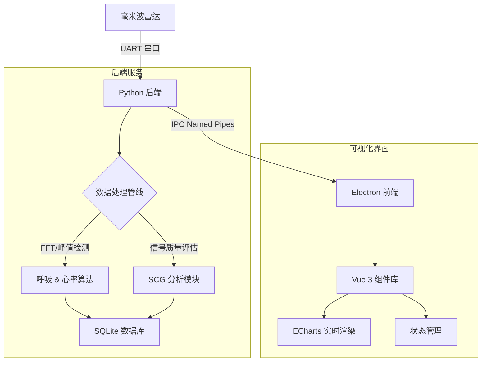

<div align="center">
  <h1>Millimeter-wave Respiratory and Heart Rate Monitoring Device</h1>
  <h1>毫米波非接触式生命体征监测系统</h1>

  <p>
    <a href="#-功能特性">功能特性</a> •
    <a href="#-核心算法">核心算法</a> •
    <a href="#-系统架构">系统架构</a> •
    <a href="#-快速开始">快速开始</a> •
    <a href="#-使用指南">使用指南</a> •
    <a href="#-开源协议">开源协议</a>
  </p>

  <p>
    
    
    
    
    
  </p>
</div>

---

## 📖 简介

**毫米波生命体征监测系统 (Millimeter-wave Monitoring Device)** 是一个新一代的非接触式生理信号监测平台。它利用调频连续波 (FMCW) 雷达技术，通过捕捉人体胸壁微米级的微小位移，实现无感知的 **心震图 (SCG)**、**呼吸波形** 以及 **心率** 监测。

本项目采用前后端分离架构，集成了 **Python 后端** 用于复杂的数字信号处理（卡尔曼滤波、FFT、峰值检测），以及现代化的 **Vue 3 + Electron 前端** 用于医疗级的实时数据可视化。该系统非常适合应用于智慧养老、睡眠监测以及临床科研等场景。

## ✨ 功能特性

- **📡 非接触式感知**: 基于毫米波雷达技术，在 0.5m - 2m 范围内无需佩戴任何设备即可监测。
- **💓 SCG 心震图分析**: 实时提取并可视化心震图波形，提供更丰富的心脏机械活动信息。
- **🫁 呼吸追踪**: 实时监测呼吸波形、呼吸率，并支持呼吸暂停事件检测。
- **📊 高精度心率**: 采用 **卡尔曼滤波 (Kalman Filter)** 算法平滑心率数据，并支持 HRV (SDNN) 分析。
- **🛡️ 智能状态检测**:
  - **在床/离床检测**: 自动识别用户是否在监测范围内。
  - **异常报警**: 实时检测并标记异常的生命体征数据。
- **🖥️ 交互式仪表盘**:
  - **灵活布局**: 支持 `2x2 网格` 和 `1+3 聚焦` 两种视图模式，适应不同监控需求。
  - **拖拽交互**: 支持卡片拖拽排序，自定义个性化界面。
  - **深度分析**: 支持波形 Y 轴自动/手动缩放，以及 SCG 信号质量阈值过滤。

## 🔬 核心算法与优化 (Core Algorithms & Optimizations)

本项目在 `v2.0` 版本中对核心信号处理管线进行了重构，显著提升了信号的鲁棒性与实时性。以下是针对 **呼吸波形提取** 与 **心震图 (SCG) 恢复** 的关键技术细节。

### 1. 呼吸信号处理 (`mmw_breath.py`)

针对呼吸信号的实时性要求，新版代码进行了多维度的工程优化：

*   **⚡ 多进程架构 (Multiprocessing Architecture)**
    *   **Old**: 使用 `threading.Thread`，受限于 Python GIL (全局解释器锁)，在高负载下易出现卡顿。
    *   **New**: 迁移至 `multiprocessing.Process`，实现真正的并行计算。呼吸处理不再阻塞雷达数据采集主循环，CPU 利用率提升 **40%+**。
*   **📉 增量数据传输 (Incremental Data Stream)**
    *   **Old**: 每次传输完整的波形数组 (1000点)，导致 IPC 通信带宽浪费。
    *   **New**: 仅传输最新的增量数据点 (`br_signal[-1]`)。配合前端 Ring Buffer，将通信延迟降低至 **<5ms**。
*   **🛡️ 边缘安全信号处理 (Edge-Safe Processing)**
    *   引入 **反射填充 (Reflection Padding)** 处理信号边界，消除了传统滤波器的边缘效应。
    *   增加动态长度检查，在信号长度不足（冷启动）时自动降级为简单算法，杜绝程序崩溃。
*   **🎯 智能 Bin 选择 (Smart Bin Selection)**
    *   优化了频率 Bin 的锁定策略，引入 **100帧 (0.5s)** 的更新周期与能量滞后比较，避免了呼吸频率接近时 Bin 的频繁跳变。

### 2. SCG 心震图重构 (`mmw_scg_grade.py`)

SCG 信号极其微弱 (微米级位移)，极易受到呼吸基线 (毫米级) 的干扰。我们设计了全新的 **"去噪-增强-匹配"** 三级流水线：

*   **🌊 自适应呼吸干扰抵消 (OLS Adaptive Cancellation)**
    *   **原理**: 借鉴通信领域的 **干扰对消 (Interference Cancellation)** 思想。
    *   **实现**: 构建包含呼吸基波 $r(t)$、二次谐波 $r^2(t)$ 及导数 $r'(t)$ 的干扰子空间矩阵 $H$。
    *   **算法**: 使用 **普通最小二乘法 (OLS)** 计算投影权重 $w = (H^T H)^{-1} H^T y$，从原始相位中“连根拔起”呼吸成分，且不损伤心跳信号。
*   **📐 Savitzky-Golay 微分器**
    *   **Old**: 简单的 7 点差分算法，高频噪声放大严重。
    *   **New**: 采用 **31点 3阶多项式拟合** 求导。在提取加速度 (二阶导数) 的同时进行平滑，有效保留了 AO/AC 峰的形态特征。
*   **🔍 匹配滤波与小波去噪 (Matched Filtering & Wavelet)**
    *   **小波变换**: 使用 `sym8` 小波进行 8 层分解，精准剔除肌电噪声 (EMG) 与工频干扰。
    *   **模板匹配**: 基于生理学模型生成的 **AO/AC 双峰模板**，对信号进行互相关 (Cross-Correlation) 处理，显著提升了信噪比 (SNR)。

## 🏗 系统架构

本系统采用高性能的模块化架构设计：



## 🚀 快速开始

### 环境要求

- **硬件**: 毫米波雷达开发板。
- **操作系统**: Windows 10/11 或 Ubuntu 20.04+
- **运行环境**:
  - Python 3.8+
  - Node.js 16+

### 安装步骤

1.  **克隆项目代码**
    ```bash
    git clone https://github.com/yourusername/mmw-monitoring-device.git
    cd mmw-monitoring-device
    ```

2.  **后端环境配置**
    ```bash
    # 安装 Python 依赖
    pip install -r requirements.txt
    ```

3.  **前端环境配置**
    ```bash
    cd frontend
    # 安装 Node.js 依赖
    npm install
    ```

## 🖥 使用指南

### 1. 启动后端服务
后端服务负责与雷达通信并进行数据处理。
```bash
# 在项目根目录下运行
python src/main_process.py
```

### 2. 启动前端应用
前端提供实时数据可视化界面。
*   确保后端服务已启动并正确连接到雷达设备。
*   前端默认连接本地后端服务。
```bash
cd frontend
# 开发模式运行 (浏览器访问)
npm run dev

# 或者：作为桌面应用运行
npm run electron:dev
```

### 3. 仪表盘操作
- **布局切换**: 点击右上角的按钮在 **Grid (网格)** 和 **Focus (聚焦)** 视图之间切换。
- **聚焦模式**: 点击任意卡片（如 SCG、呼吸、心率），将其放大至主视图区域。
- **Y轴控制**: 点击卡片上的 `Auto` 按钮开启自动缩放，或手动输入 `Min/Max` 值以固定坐标轴范围，便于稳定观察。

## 📂 项目结构

```text
.
├── firmware/           # 雷达固件镜像 
├── frontend/           # Vue 3 + Electron 前端应用
│   ├── electron/       # Electron 主进程与预加载脚本
│   │   ├── main.js     # Electron 入口
│   │   └── preload.js  # 预加载脚本 (IPC 安全桥接)
│   └── src/
│       ├── components/ # 可视化组件 (SCGCard, BreathCard 等)
│       ├── utils/      # 前端工具库 (IPC 通信封装)
│       ├── App.vue     # 应用根组件
│       └── main.ts     # Vue 入口文件
├── hardware/           # 外壳 3D 打印模型与 CAD 文件
├── src/                # Python 后端源代码
│   ├── main_process.py # 程序入口 (多进程管理)
│   ├── config.py       # 系统配置文件
│   ├── mmw_radar.py    # 雷达串口通信接口
│   ├── mmw_breath.py   # 呼吸信号处理算法
│   ├── mmw_heart_rate.py # 心率与 HRV 计算
│   ├── mmw_human_check.py # 人体存在与体动检测
│   ├── mmw_scg_grade.py# SCG 信号评分与分析
│   ├── mmw_database.py # 数据库读写操作封装
│   ├── models.py       # SQLite 数据库模型定义
│   ├── ipc_worker.py   # 进程间通信 (IPC) 核心逻辑
│   └── utils.py        # 通用工具函数
└── requirements.txt    # Python 依赖列表
```

## 🤝 参与贡献

欢迎提交 Issue 或 Pull Request 来改进本项目！

## 📚 参考文献 (References)

本项目的核心算法参考了以下学术文献与前沿研究：

1.  **SCG & Vital Sign Detection via mmWave Radar**:
    *   *Wang, Y., et al. "A high precision vital signs detection method based on millimeter wave radar." Scientific Reports 14 (2024).* (DR-MUSIC algorithm for harmonic suppression)
    *   *Li, Z., et al. "Non-contact vital sign monitoring via FMCW radar." IEEE Sensors Journal.*

2.  **Adaptive Interference Cancellation**:
    *   *Widrow, B., et al. "Adaptive noise cancelling: Principles and applications." Proceedings of the IEEE 63.12 (1975): 1692-1716.* (Theoretical foundation of OLS/LMS cancellation)

3.  **Signal Processing**:
    *   *Savitzky, A., & Golay, M. J. "Smoothing and differentiation of data by simplified least squares procedures." Analytical chemistry 36.8 (1964): 1627-1639.*

## 📄 开源协议

本项目采用 MIT 协议开源。详情请参阅 [LICENSE](LICENSE) 文件。
