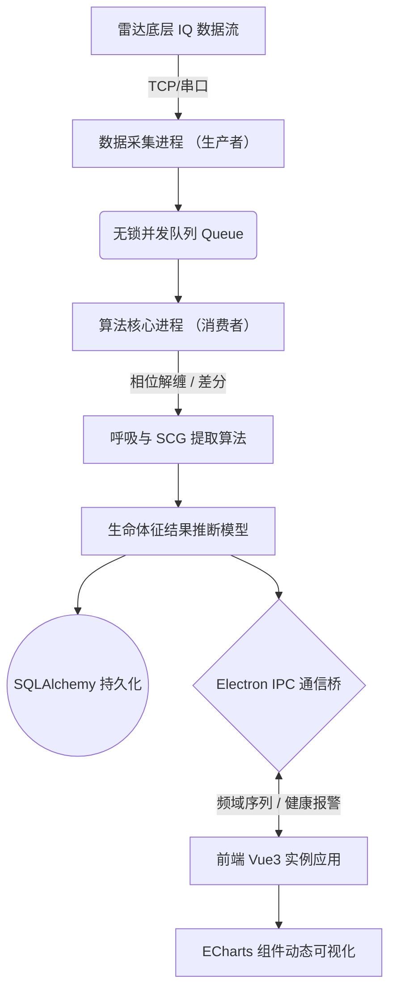
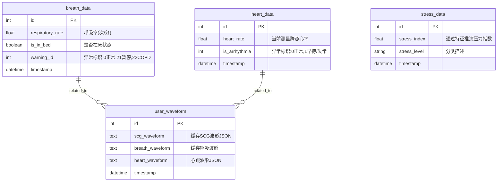

# 基于毫米波雷达的人体生理指标实时提取与抗干扰系统设计
## 毕业设计（论文）中期进展报告

**摘要**：构建了基于毫米波雷达的非接触生理指标监测系统与前后端高并发架构。尝试了FMCW相位解缠与7点差分算法，成功分离心震图与呼吸信号，实现连续心率提取与早搏快筛。主要难点是动态场景下抗微动干扰能力较弱，且异常病理验证样本受限。下一步工作是优化体动伪影滤除机制，扩充样本集并深化细粒度波形评估。

## 1. 引言
本项目旨在使用毫米波雷达设计一套非接触式的人体生理指标实时提取与抗干扰系统。系统通过利用毫米波既能测距又对微动敏感的特点，实现大幅度呼吸机械运动与亚毫米级别的心脏机械运动捕捉，实现心脏运动加速度信号——即心震图（SCG）——与呼吸信号的提取与分离。此外，系统前瞻性地搭载了早搏检测算法，实现部分心律失常的快速筛查。
与传统多导睡眠图仪、ECG或可穿戴设备相比，本项目最大的创新在于**“非接触 + 长期连续”**。用户无需佩戴任何设备，监测过程零干扰，能够实现真正的无感健康监测。

## 2. 毫米波雷达感知技术解析与核心算法实现

### 2.1 获取人体距毫米波雷达距离
项目采用调频连续波（FMCW）毫米波雷达。雷达发射天线（Tx）持续发射频率线性扫频的连续微波信号，利用发射波与反射波的频率差与相位差实现距离和运动检测。由能量最大的反射波与同一扫频周期内的发射波进行混频后得到拍频（中频信号），通过拍频可推导传播时间，从而精确定位人体相对雷达的距离。

### 2.2 获取胸腔振动位移原始信号
为精准提取胸腔的震动信号，首先对雷达混频后的拍频信号进行距离划分：将雷达可探测的整个距离范围，按照 **5cm 作为一个区间（bin）** 进行切分。
通过距离测算定位胸腔所在的 bin 后，对完整扫频周期内的拍频信号进行 FFT 得到复数序列。提取该复数的相位，由于 `arctan2` 运算的值域限制，当运动位移引发相移超过 $\pi$ 时会出现空间跳变（相位缠绕）。系统应用了相位解缠（Phase Unwrapping）处理，消除跳变误差，从而获得能反映胸腔真实振动位移的连续连续相位序列（原始位移信号）。

### 2.3 分离 SCG 与呼吸信号
考虑到呼吸引起的胸部振动幅度通常在几毫米量级，远大于心脏振动的亚毫米量级，但呼吸运动缓慢平稳（加速度极低），而心脏活动是心肌的快速收缩，会在心跳骤缩过程中产生显著的加速度。因此，本系统通过提取**加速度信息**来分离心脏运动并消除呼吸干扰：
1. **SCG提取**：胸部加速度波形可由胸部振动位移数据的二阶导数计算得到，系统实施了基于最小二乘平滑法的 **7点差分法** 进行滤波推演，获取高精细度的 SCG 波形。
2. **呼吸提取**：成年人静息呼吸率一般在 0.1~0.5Hz（对应 6~30次/分钟），考虑到信噪比高与计算开销，选择使用一阶巴特沃斯（Butterworth）带通滤波器直接从原始位移信号中提取分离出纯净的呼吸波形。

### 2.4 心率计算与早搏检测
* **心率提取算法**：对提取到的 SCG 波形进行归一化之后，计算其自相关函数；随后对自相关函数执行 FFT 分析，并在系统心率阈值对应频段（约 0.75~2.5Hz，即 45~150 bpm）范围内提取频谱峰值以获得准确心率。经过实验室与医用设备对照，测试验证误差能控制在 $\pm3$ bpm 以内。
* **早搏检测逻辑**：不仅限于心率统计，系统从提取到的 SCG 波形中寻找并提取 R 峰峰值序列，再计算出平均 R-R 间期。依据此间期建立动态判定基准进行异常波动检测。目前此快筛算法在自有数据集上测试准确率达到了 95.67%。

## 3. 系统软硬件设计与实现

### 3.1 硬件外壳与实验平台搭建
为提升设备内部模块的集成度、保护底层核心感知传感器并降低装配复杂度，本项目利用 SolidWorks 设计了专用模块化保护外壳，并通过 3D 打印加工，实现了结构坚固、功能集成与可维护性的平衡。同时搭建了一套基于此硬件的毫米波雷达生理信号感知实验一体机，实现了从“活体数据采集 - 实时信号处理 - 结果交互可视化”的全流程闭环。

### 3.2 软件系统架构与前后端设计
系统软件部分采用典型的多层软件架构及**前后端分离**的本地现代架构进行解耦设计，以保障系统的实时性、稳定性和高内聚低耦合特性：

1. **交互前端层（可视化模块）**：
   前端基于 Vue3 框架（Composition API）结合 Vite 构建，借由 Electron 框架打包为跨平台桌面客户端应用。前端主要负责多生理波形实时绘制、参数配置下发与界面交互。在实现上，采用 ECharts 结合 Vue 响应式绑定机制，构建了如 `BaseChartCard.vue`、`HeartRateCard.vue` 等可复用的高帧率渲染组件，为算法验证与临床监测提供直观支撑。
2. **Python 后端层（核心业务与分析模块）**：
   后端引入了**生产者 - 消费者多线程并发模型**。在保障高算力消化的同时，实现了底层通信与高耗时计算的完全解耦：
   * **采集层（生产者）**：负责接收雷达 IQ 底层数据，处理串口/网络推流协议，写入无锁缓冲队列。
   * **算法层（消费者）**：从队列中获取数据后，依托 NumPy、SciPy 执行多普勒相位解缠、预处理、独立成分提取、数字带通滤波及 SCG 波形重构分离与推理。
3. **IPC 进程间双向通信桥梁**：
   前后端间使用 Electron IPC 通信机制（通过 `ipcMain` 与 `ipcRenderer` 的本地 Socket/IPC 通道）进行指令与特征数组的双向同步，完成参数下发与健康状态、波形字典结果的上推，实现了从数据感知到可视化的全流程闭环验证。系统扩展性强，可随时支持后续智能化功能迭代。

### 3.3 数据库设计方案与数据字典
数据服务端集成了 SQLAlchemy 框架作为底层 ORM 数据引擎持久化存储架构，采用 SQLite 建立关系型物理模型，用于保留用户连续的监测病历与状态历史以便后续临床归因分析。按照软件工程规范，主要的系统概念结构（E-R模型）与核心物理结构设计如下：

#### 3.3.1 概念与逻辑结构设计设计
通过需求拆解，系统主要分为生理特征数据（如呼吸、心率）、波形缓存结构及深层健康分析（压力、心律失常标记）。核心实体关系模型描述如下：

#### 3.3.2 物理结构设计 (主要数据字典)
在数据库物理层面，各高频产生的数据表的具体属性与约束如下（提取自核心业务模型）：

**表 3-1：心率特征数据表（heart_data）**

| 字段名称 | 数据类型 | 约束 | 描述 |
| :--- | :--- | :--- | :--- |
| `id` | Integer | Primary Key, Auto Increment | 主键ID |
| `timestamp` | DateTime | Not Null | 记录创建与测量推断的时间戳 |
| `heart_rate` | Float | Nullable | FFT及自相关模块提取出的系统心率值 |
| `is_in_bed` | Boolean | Default True | 用户是否处于雷达波束监测有效方位内 |
| `is_arrhythmia` | Integer | Default 0 | 早期预警标志（0:正常, 1:心动过早/心律失常） |

**表 3-2：呼吸特征数据表（breath_data）**

| 字段名称 | 数据类型 | 约束 | 描述 |
| :--- | :--- | :--- | :--- |
| `id` | Integer | Primary Key, Auto Increment | 主键ID |
| `timestamp` | DateTime | Not Null | 测量推断的时间戳 |
| `respiratory_rate` | Float | Nullable | 数字带通滤波后计算输出的呼吸频率 |
| `is_in_bed` | Boolean | Default True | 是否在监测床体状态内 |
| `warning_id` | Integer | Default 0 | 潜在慢病警告（0:正常, 21:睡眠呼吸暂停症预警）|

**表 3-3：波形流缓存结构表（user_waveform）**
本机制主要用于高保真度缓存传递给前端渲染所需的高频离散连续点机制，运用文本格式按量存入格式化的字符串或 JSON 数组。

| 字段名称 | 数据类型 | 约束 | 描述 |
| :--- | :--- | :--- | :--- |
| `id` | Integer | Primary Key | 主键 |
| `breath_waveform` | Text | Nullable | 呼吸时域滤波长序列 (JSON格式) |
| `scg_waveform` | Text | Nullable | 7点差分计算的心振图提取特征波序列 (JSON格式) |
| `heart_waveform` | Text | Nullable | 用于参考对比的心跳波形 (JSON格式) |
| `timestamp` | DateTime | Default Now | 波形数组落库与刷新时间 |
## 4. 目前已完成进度与面临之问题

### 4.1 目前已按计划完成的任务
* [x] 雷达底层通讯对接，跑通拍频数据获取、距离 bin 切分与相位解缠绕等物理计算。
* [x] 基于二阶导数和 7点差分法，从强呼吸干扰原始位移信号中成功分离出微小亚毫米级的心跳 SCG 震动信号。
* [x] 实现自相关加 FFT 频率搜索机制统计心率；实现基于 R 峰间期阈值的早搏检测算法模型，混淆矩阵分析符合预期。
* [x] 完成了结构件外观开发、外壳模型 3D 打印及测试样机搭建。
* [x] 系统前后端（Vue3 + Python 并发机制）交互联调完毕，可正常显示分析波形。

### 4.2 当前遇到的技术瓶颈与解决路线
1. **真实动态场景抗微动干扰能力有限**
   * **问题**：在被测人体展现出非规律身体微动时系统鲁棒性仍有不足，信号极易受损，出现短暂误报。
   * **解决办法**：持续深耕信号预处理阶段研究，计划继续调整算法滤波与平滑的超参以期提升结果质量，尝试增设体动伪影滤除逻辑。
2. **心律异常算法验证缺乏样本生态**
   * **问题**：目前内部验证数据集的健康样本和病理样本量依旧偏小，早搏与异常分类算法泛化评估存在局限。
   * **解决办法**：需继续在多组受试者间推动大规模实验采集流程以扩充自建库，增加更多临床场景对比来校验性能指标。

## 5. 尚需完成与推进的工作规划
按照毕业设计下半程任务要求进度，接下来的几个侧重点是：
1. **波形及统计算法优化模块探索**：不断打磨并改善心率运算周期延迟及早期波形异常判断模块，保障持续追踪精准度。
2. **高细粒度 SCG 射血波形特性分析**：突破仅检测频率的局限，重点优化后端核心计算逻辑，从复原后波形上寻找精细刻画“心脏射血周期特征峰值与拐点时序”的可行性理论支撑。
3. 着手整理各项系统测试报告指标及核心框架原理，全面推进毕业论文正文的撰写任务。
