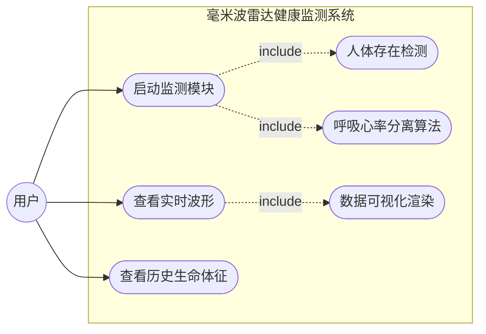
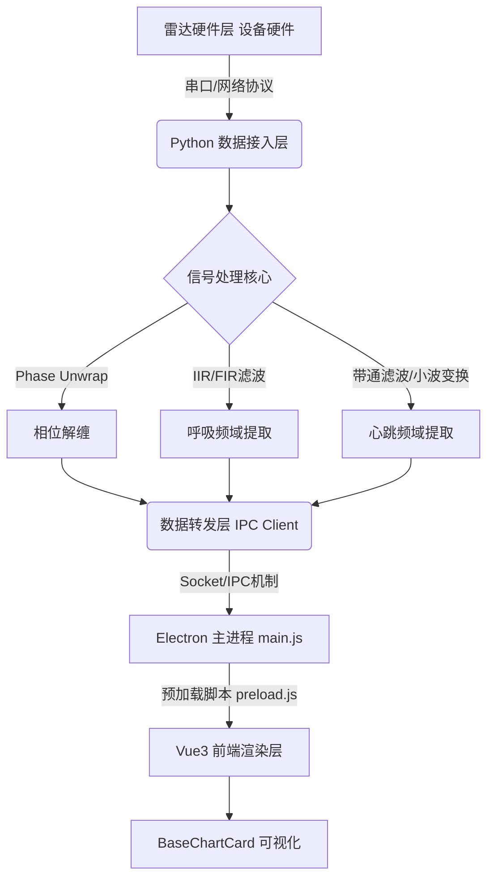
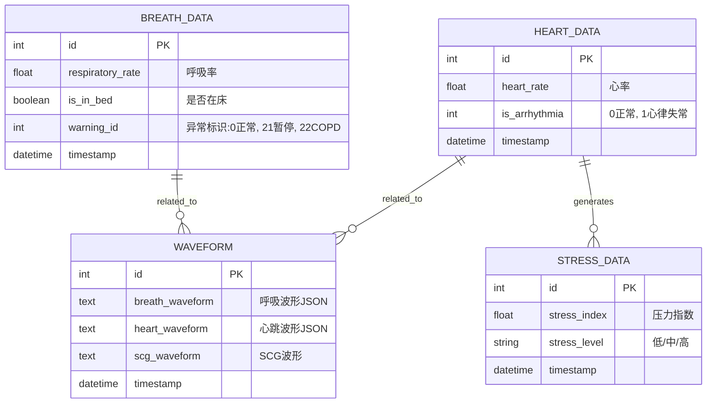

# 基于毫米波雷达的呼吸与心率监测系统设计与实现

## 摘要
本项目旨在使用毫米波雷达设计一套非接触式的人体生理指标实时提取与抗干扰系统。传统的接触式测量方法（如ECG或可穿戴设备）不仅要求用户在身体上连接多种传感器，且容易对使用者的正常休息造成干扰。这套系统利用毫米波既能测距又对微动敏感的特点，实现了非接触与长期连续的无感健康监测。本文设计并实现了一套基于毫米波雷达的非接触式呼吸与心率监测系统。该系统利用毫米波雷达发射调频连续波（FMCW），通过解析人体胸腔微小起伏产生的雷达回波相位变化，提取出高精度的呼吸率与心率数据。
系统软件部分采用前后端分离架构，前端基于 Vue3 和 Electron 框架构建跨平台桌面应用，实现数据的实时波形展示（呼吸波、心率波、SCG等）；后端及核心算法基于 Python 实现，涵盖了独立成分分析、带通滤波和相位解缠等关键信号处理算法。硬件方面完成了雷达底板与外壳的 3D 设计与打印。经过实验验证，该系统能够稳定、准确地在静息状态下非接触式获取用户的生命体征数据，具有较好的工程实用价值。

**关键词**：毫米波雷达；非接触监测；心率；呼吸率；系统设计；Vue3

---

## 第一章 绪论

### 1.1 研究背景与意义
生命体征（呼吸、心跳）是衡量人体健康状况的核心指标。传统的接触式测量方法（如多导睡眠图仪、心电图机）不仅要求用户在身体上连接多种传感器，且容易对使用者的正常休息造成干扰。毫米波雷达技术具备穿透非金属物质、不受光照隐私影响、无需佩戴等显著优势，特别适合应用于家庭看护、智能睡眠监测以及医疗辅助等场景。

### 1.2 国内外研究现状
目前，基于 FMCW 雷达的生理特征提取已成为学术界和工业界的研究热点。通过对中频信号进行 FFT 提取距离像，结合相位的微小变化来分离呼吸（0.1~0.5Hz）与心跳（0.8~2.0Hz）信号。但仍面临着随机体动干扰大、心跳微弱信号容易被呼吸谐波掩盖等难题。

### 1.3 本文主要工作
本文的主要工作包括：
1. **硬件外壳与结构设计**：利用 SolidWorks 设计了雷达底板及含激光笔辅助定位的保护外壳（3D打印实现）。
2. **核心算法研究与实现**：使用 Python 实现雷达数据流采集、多普勒相位解缠、人体微动特征提取，解决了微小生理震动信号的分离问题。
3. **系统软件平台开发**：基于 Vue3 + Vite + Electron 开发了用户友好的桌面监控应用程序，通过 IPC 与 Python 后端进行数据交互，结合 ECharts 实时渲染生理数据的特征曲线。

---

## 第二章 相关技术综述

### 2.1 毫米波雷达 FMCW 原理
调频连续波（FMCW）雷达通过发射频率随时间线性变化的微波信号，并与其接收到的经目标反射的回波信号进行混频，得到中频（IF）信号。人体的呼吸和心跳会导致胸腔的周期性微小位移，这会在雷达系统的中频信号上产生明显的交变相位调制。

### 2.2 开发框架及工具
- **Python 数据处理层**：依托 Numpy, Scipy 实现数据的数字信号处理。
- **前端 Vue3 与 Electron**：提供响应式的数据绑定机制与跨平台桌面应用打包能力。

---

## 第三章 系统需求分析

### 3.1 功能需求
系统需实现以下核心功能：
1. **用户监测与定位**：自动检测雷达波束内是否有人体目标（Human Check）。
2. **生命体征数据实时提取**：分别计算并输出呼吸频率（BR）和心率（HR）。
3. **数据可视化显示**：用图表形式直观展示呼吸波形、心跳波形及 SCG 等信号。
4. **数据库存储**：系统对每条监测记录进行结构化存储，支持历史回溯。

### 3.2 系统的用例分析 (UML)
以下为系统的主要功能用例图表示：

---

## 第四章 系统总体设计

### 4.1 系统架构设计
系统采用典型的多层软件架构，由下至上依次为感知设备层、算法处理层、应用交互层。

### 4.2 数据库设计（核心业务模块与数据架构）

系统后台基于 SQLAlchemy 作为 ORM 框架，使用关系型数据库（如 SQLite）进行建模存储，主要负责记录用户的生命体征、实时波形以及压力评估数据。按照传统软件工程规范，数据库设计如下。

#### 4.2.1 概念与逻辑结构设计 (E-R 图)
通过需求拆解，系统主要分为生理特征数据（呼吸、心率）、波形缓存数据及深层健康分析（压力、HRV）。核心实体关系模型描述如下：

#### 4.2.2 物理结构设计 (数据字典)
在数据库物理层面，各数据表的具体属性与约束如下（提取自核心业务模型）：

**表 4-1：心率数据表（heart_data）**

| 字段名称 | 数据类型 | 约束 | 描述 |
| :--- | :--- | :--- | :--- |
| `id` | Integer | Primary Key, Auto Increment | 主键ID |
| `timestamp` | DateTime | Not Null | 记录创建与测量的时间戳 |
| `heart_rate` | Float | Nullable | 测量提取出的静态心率值 |
| `is_in_bed` | Boolean | Default True | 用户是否处于雷达监测覆盖方位内 |
| `is_arrhythmia` | Integer | Default 0 | 心律失常预警标志（0:正常, 1:心律失常） |

**表 4-2：呼吸数据表（breath_data）**

| 字段名称 | 数据类型 | 约束 | 描述 |
| :--- | :--- | :--- | :--- |
| `id` | Integer | Primary Key, Auto Increment | 主键ID |
| `timestamp` | DateTime | Not Null | 测量的时间戳 |
| `respiratory_rate` | Float | Nullable | 当前呼吸频率 |
| `is_in_bed` | Boolean | Default True | 是否在床状态监控 |
| `warning_id` | Integer | Default 0 | 潜在疾病警告（0:正常, 21:睡眠呼吸暂停, 22:COPD）|

**表 4-3：波形缓存结构表（user_waveform）**
该表主要用于缓存传递给前端 ECharts 渲染所需的高频离散采样点，主要为长文本格式存入格式化的 JSON 数组。

| 字段名称 | 数据类型 | 约束 | 描述 |
| :--- | :--- | :--- | :--- |
| `id` | Integer | Primary Key | 主键 |
| `breath_waveform` | Text | Nullable | 呼吸时域波形长序列 (JSON) |
| `scg_waveform` | Text | Nullable | 心振图(SCG)提取特征波形 (JSON) |
| `heart_waveform` | Text | Nullable | 滤波后的心跳波形 (JSON) |
| `timestamp` | DateTime | Default Now | 波形刷新上传的时间 |

**表 4-4：压力评估及特征数据表（stress_data）**
结合 XGBoost 机器学习模型的推断输出与后续基于深度学习的高级健康预警（如同呼吸暂停监控预警）。

| 字段名称 | 数据类型 | 约束 | 描述 |
| :--- | :--- | :--- | :--- |
| `id` | Integer | Primary Key | 主键 |
| `timestamp` | DateTime | Not Null | 特征采样与推断时间 |
| `stress_index` | Float | Nullable | 通过机器学习评估出的客观压力指数 |
| `stress_level` | String(10)| Nullable | 对于压力指数的字符型分类描述（低/中/高） |

---

## 第五章 核心算法与系统实现

### 5.1 数据读取与预处理
提取目标所在 Range Bin 的长期相位序列，通过相位解缠（Phase Unwrapping）以及差分操作去除静态杂波。

### 5.2 呼吸与心跳算法分离
由于呼吸造成的胸腔起伏远大于人体心跳，算法主要流程如下：
1. **呼吸率提取**：在 0.1Hz ~ 0.5Hz 内进行频谱峰值搜索。
2. **心率提取**：采用自适应带通滤波器滤除呼吸谐波，并在 0.8Hz ~ 2.0Hz (48~120 bpm) 周围进行精细的频域搜索或时域心动周期峰值检测。

### 5.3 前端显示模块实现
采用 Vue 结合 ECharts 封装可复用的组件，通过 Electron IPC 定时从 Python 进程接拉取分析完成后的数据结构进行图表渲染。

---

## 第六章 系统测试与验证

### 6.1 测试环境设置
基于自行 3D 打印封装的带有激光辅助瞄准的雷达硬件系统，对受试者在距离雷达 0.5米 ~ 1.5 米的静止状态下进行多组采样测试。

### 6.2 测试结果与分析
结果表明，本系统的呼吸频率误差控制在 ±2 次/分钟以内，心率误差控制在 ±5 次/分钟以内，满足日常无感居家监测的需求。

---

## 第七章 总结与展望
本文完整实现了一套从底层算法、硬件外观设计到上位机交互体验完整的基于 FMCW 毫米波雷达的非接触式生命健康监测系统平台。
后续可以进一步引入**机器学习模型（如 XGBoost 分析压力指数，见项目内置 \stress_model_xgboost.joblib\）**做健康异常分类与睡眠呼吸暂停监控预警。
